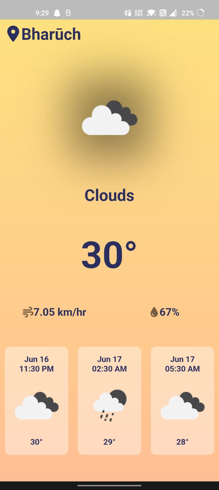

# Weather App

- A weather app made using flutter.
- It asks for the user to access it's location and then provides the user with the weather of it's current location.
- It tells the current temperature, wind speed and humidity.

</img>
</img>
</img>

- Design credits to [Natalia Berdnyk for Uptech](https://dribbble.com/shots/14784828-Weather-forecast-interface)

[APK](./build/app/outputs/flutter-apk/app-release.apk)
